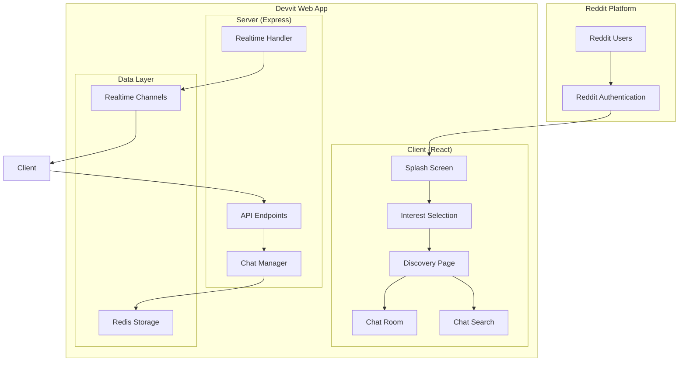

# Design Document

## Overview

Campfire is a real-time chat application built on the Devvit Web platform that enables Reddit users to discover, create, and participate in live chat rooms. The application leverages Devvit's real-time messaging capabilities, Redis for data persistence, and Reddit's authentication system to create a seamless social experience within the Reddit ecosystem.

The application follows a client-server architecture where the React-based client handles the user interface and user interactions, while the Express server manages chat room operations, message routing, and data persistence through Redis.

## Architecture

### High-Level Architecture



### Real-Time Communication Flow

The application uses Devvit's real-time capabilities for instant message delivery:

1. **Client Connection**: Each chat room participant connects to a unique real-time channel
2. **Message Sending**: Messages are sent via API endpoints to the server
3. **Message Broadcasting**: Server broadcasts messages to all channel subscribers
4. **Message Persistence**: Messages are stored in Redis for chat history

### Data Architecture

**Redis Data Structure:**
- `chatroom:{id}`: Chat room metadata (title, topic, creator, participants)
- `chatroom:{id}:messages`: Ordered list of messages with timestamps
- `user:{userId}:interests`: User's selected interest tags
- `user:{userId}:active_chats`: List of chat rooms user is currently in
- `interests:{tag}`: List of chat rooms tagged with specific interest
- `active_chatrooms`: Set of currently active chat room IDs

## Components and Interfaces

### Client Components

#### 1. Splash Screen Component
- **Purpose**: Welcome users and introduce the app
- **Features**: 
  - Animated Campfire branding
  - Engaging call-to-action button
  - Fun, bubbly design elements
- **Navigation**: Leads to Interest Selection

#### 2. Interest Selection Component
- **Purpose**: Capture user preferences for personalized experience
- **Features**:
  - Grid of selectable interest tags
  - Maximum 5 selections with visual feedback
  - Skip option for users who prefer not to set interests
  - Progress indicator
- **Data**: Stores selections in Redis under `user:{userId}:interests`

#### 3. Discovery Page Component
- **Purpose**: Main hub for finding and accessing chat rooms
- **Features**:
  - Live chat room list with real-time updates
  - Filtering by user interests
  - Participant count and activity indicators
  - Navigation bar with create and search options
- **Real-time**: Subscribes to `discovery` channel for live updates

#### 4. Chat Room Component
- **Purpose**: Real-time messaging interface
- **Features**:
  - Message history display
  - Real-time message updates
  - Text input with send functionality
  - Participant list
  - Leave chat option
- **Real-time**: Subscribes to `chatroom:{id}` channel

#### 5. Chat Search Component
- **Purpose**: Find specific chat rooms
- **Features**:
  - Real-time search as user types
  - Filter by title, topic, or interest tags
  - Search result display with join options

#### 6. Chat Creation Component
- **Purpose**: Create new chat rooms
- **Features**:
  - Chat room title and topic input
  - Interest tag selection
  - Privacy settings (if applicable)
  - Create and cancel options

### Server API Endpoints

#### Authentication & User Management
- `GET /api/user/profile` - Get current user information
- `POST /api/user/interests` - Set user interests
- `GET /api/user/interests` - Get user interests

#### Chat Room Management
- `GET /api/chatrooms` - Get available chat rooms (with optional filtering)
- `POST /api/chatrooms` - Create new chat room
- `GET /api/chatrooms/:id` - Get specific chat room details
- `POST /api/chatrooms/:id/join` - Join a chat room
- `POST /api/chatrooms/:id/leave` - Leave a chat room
- `DELETE /api/chatrooms/:id` - Delete chat room (creator only)

#### Messaging
- `GET /api/chatrooms/:id/messages` - Get chat history
- `POST /api/chatrooms/:id/messages` - Send message to chat room

#### Search & Discovery
- `GET /api/search/chatrooms` - Search chat rooms by query
- `GET /api/interests` - Get available interest tags

### Real-Time Channels

#### Channel Structure
- `discovery` - Global channel for chat room availability updates
- `chatroom:{id}` - Individual chat room message channels
- `user:{userId}` - Personal notifications and updates

#### Message Types
```typescript
type RealtimeMessage = {
  type: 'message' | 'user_joined' | 'user_left' | 'room_created' | 'room_deleted';
  data: {
    chatRoomId?: string;
    userId: string;
    username: string;
    content?: string;
    timestamp: number;
  };
};
```

## Data Models

### User Profile
```typescript
type UserProfile = {
  id: string;
  username: string;
  interests: string[];
  activeChats: string[];
  createdAt: number;
};
```

### Chat Room
```typescript
type ChatRoom = {
  id: string;
  title: string;
  topic: string;
  creatorId: string;
  creatorUsername: string;
  participants: string[];
  participantCount: number;
  interests: string[];
  isActive: boolean;
  createdAt: number;
  lastActivity: number;
};
```

### Message
```typescript
type Message = {
  id: string;
  chatRoomId: string;
  userId: string;
  username: string;
  content: string;
  timestamp: number;
};
```

### Interest Tag
```typescript
type InterestTag = {
  id: string;
  name: string;
  description: string;
  color: string;
  chatRoomCount: number;
};
```

## Error Handling

### Client-Side Error Handling
- **Network Errors**: Display retry options and offline indicators
- **Real-time Connection Loss**: Automatic reconnection with user feedback
- **Message Send Failures**: Queue messages and retry with visual feedback
- **Authentication Errors**: Redirect to Reddit authentication flow

### Server-Side Error Handling
- **Redis Connection Issues**: Graceful degradation with in-memory fallback
- **Rate Limiting**: Implement per-user message rate limits
- **Invalid Requests**: Comprehensive input validation and sanitization
- **Chat Room Capacity**: Enforce maximum participants per room

### Error Response Format
```typescript
type ErrorResponse = {
  error: true;
  code: string;
  message: string;
  details?: any;
};
```

## Testing Strategy

### Unit Testing
- **Client Components**: React Testing Library for component behavior
- **Server Endpoints**: Jest for API endpoint functionality
- **Data Models**: Validation and transformation logic testing
- **Real-time Handlers**: Mock channel testing

### Integration Testing
- **Client-Server Communication**: End-to-end API testing
- **Real-time Messaging**: Multi-client message delivery testing
- **Redis Operations**: Data persistence and retrieval testing
- **Authentication Flow**: Reddit integration testing

### Performance Testing
- **Message Throughput**: Test high-volume message handling
- **Concurrent Users**: Test multiple users in same chat room
- **Redis Performance**: Test data operations under load
- **Real-time Latency**: Measure message delivery times

### Security Testing
- **Input Sanitization**: Test XSS and injection prevention
- **Authentication**: Verify Reddit user context handling
- **Rate Limiting**: Test message spam prevention
- **Data Privacy**: Ensure user data isolation

## Security Considerations

### Content Safety
- **Message Filtering**: Implement basic profanity and spam detection
- **User Reporting**: Allow users to report inappropriate content
- **Moderation Tools**: Basic admin controls for chat room management
- **Content Compliance**: Ensure all content follows Reddit's content policy

### Data Protection
- **User Privacy**: Store minimal user data, respect deletion requests
- **Data Encryption**: Use HTTPS for all communications
- **Session Management**: Leverage Reddit's authentication system
- **Data Retention**: Implement automatic message expiration

### Platform Compliance
- **Reddit API Limits**: Respect rate limits and usage policies
- **Devvit Rules**: Follow all platform safety and privacy rules
- **User Consent**: Clear disclosure of data usage and permissions
- **Content Attribution**: Proper attribution of user-generated content

## Performance Optimization

### Client Optimization
- **Message Virtualization**: Efficiently render large message lists
- **Connection Management**: Optimize real-time connection lifecycle
- **State Management**: Efficient React state updates for real-time data
- **Bundle Optimization**: Code splitting for faster initial load

### Server Optimization
- **Redis Optimization**: Efficient data structures and queries
- **Connection Pooling**: Manage real-time channel connections
- **Caching Strategy**: Cache frequently accessed chat room data
- **Rate Limiting**: Prevent abuse while maintaining responsiveness

### Real-time Optimization
- **Channel Management**: Efficient subscription/unsubscription
- **Message Batching**: Group rapid messages for better performance
- **Connection Recovery**: Fast reconnection after network issues
- **Memory Management**: Clean up inactive chat room data

## Deployment Considerations

### Devvit Platform Requirements
- **Node.js Version**: 22.2.0 or higher
- **Bundle Size**: Optimize for Devvit's size limits
- **Request Timeouts**: Ensure all operations complete within 30 seconds
- **Memory Usage**: Efficient memory management for serverless environment

### Configuration
- **Redis Configuration**: Optimize for chat application patterns
- **Real-time Configuration**: Set appropriate channel limits
- **Environment Variables**: Secure configuration management
- **Monitoring**: Basic logging and error tracking

### Scalability Planning
- **Chat Room Limits**: Define maximum participants per room
- **Message History**: Implement message retention policies
- **User Limits**: Plan for concurrent user capacity
- **Data Growth**: Monitor and manage Redis storage usage
